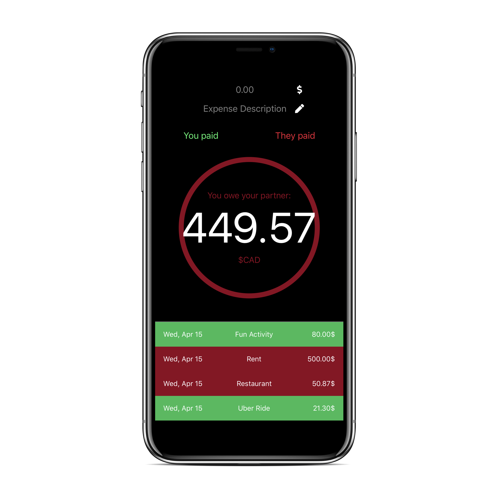

# Expense Tracker Mobile App

My first *React Native* project. Me and my partner often buy things for eachother but would still like to remain 
fair and pay back any expense.

Since I have **1.00$** transaction fee with my bank everytime I do a transfer, I figured this app will pay by itself by just 
marking the expenses and tracking the total instead of doing transfers each time.



### Features
- [x] Track total debt between you and your partner
- [ ] Retain a history of dated transactions
- [ ] Sync storage between you and your partner

### Development

```
# Launch for iOS
yarn ios
```

### License
MIT